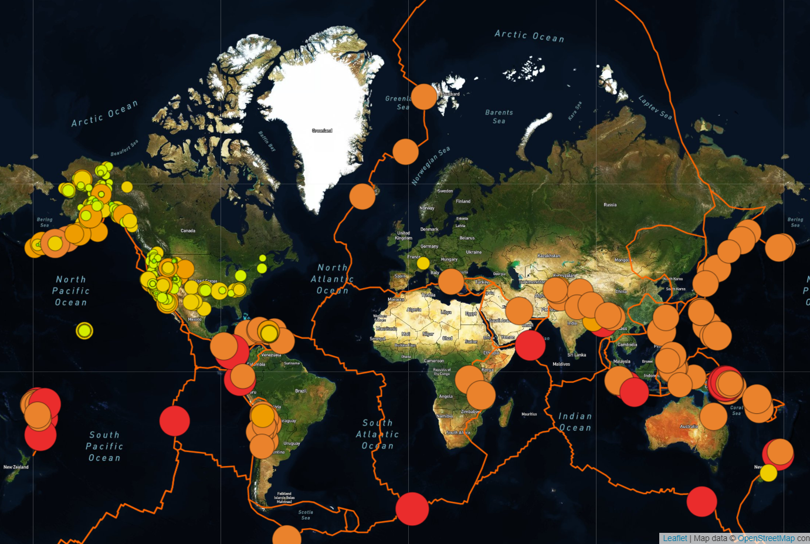

# Mapping_Earthquakes

## Project Overview

## Resources
Data Source: GeoJSON/PB2002_boundaries.json, index.html Software: Visual Studio Code 1.45.1, Google Chrome Inspect

## Challenge Overview
The goals of this challenge:

1. Use d3.json() to get tectonic plate data and add the data using the L.geoJSON() layer.
2. Style the tectonic plate LineString data to stand out on the map.
3. Add the tectonic plate data as an overlay with the earthquake data.
4. Add a third map style to allow the user to select from three different maps.

Mapping Earthquakes Image

